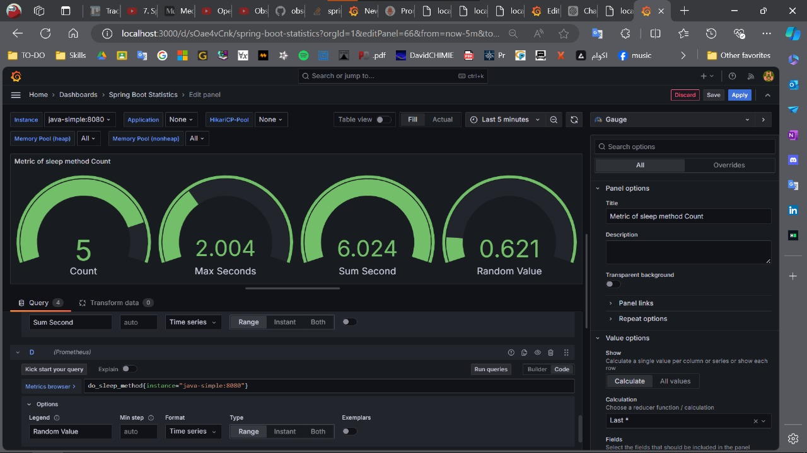
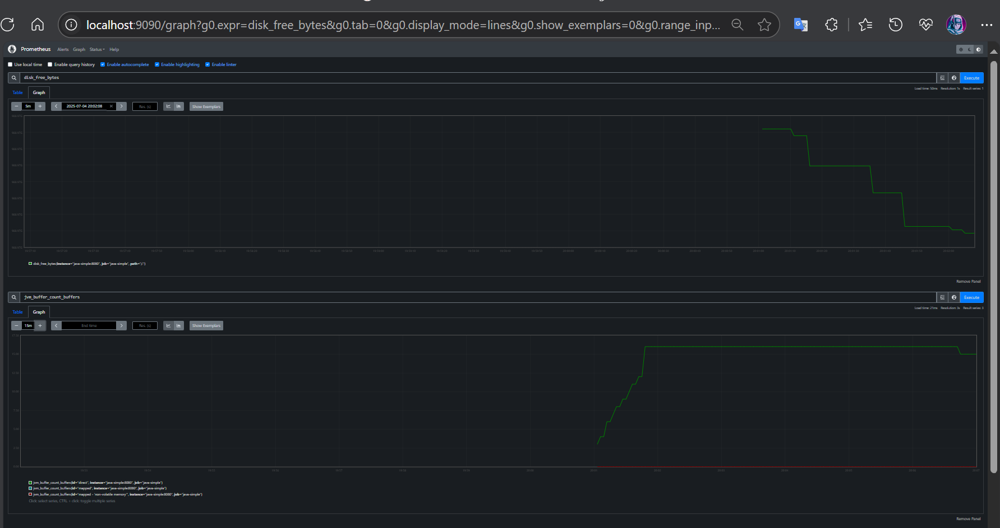
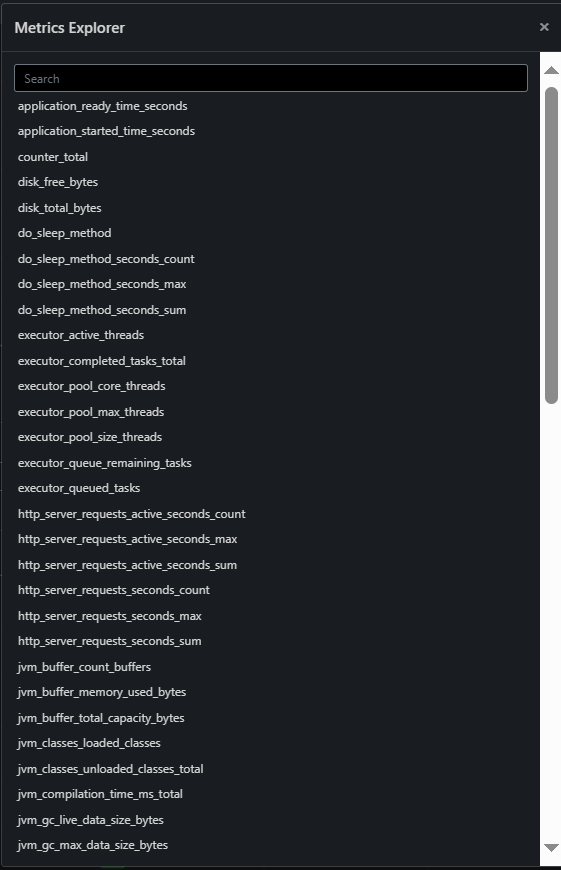
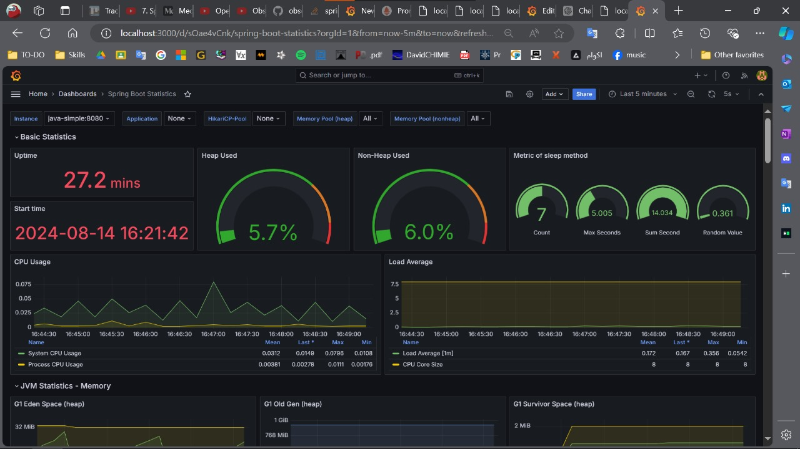

# SimpleObservabilityStack

**SimpleObservabilityStack** is a Docker-based project that sets up a basic observability stack for a Java application. It includes services for metrics collection, distributed tracing, logging, and monitoring, integrated with a simple Java application.

## Table of Contents

- [Introduction](#introduction)
- [Project Structure](#project-structure)
- [Services](#services)
- [Getting Started](#getting-started)
- [Usage](#usage)
- [Configuration](#configuration)
- [Contributing](#contributing)
- [License](#license)

## Introduction

This project demonstrates how to set up a Java microservice with observability tools using Docker. The stack includes Prometheus for metrics, Grafana for monitoring, Tempo for distributed tracing, and Loki for logging. These tools are orchestrated using Docker Compose.

## Project Structure

```
.
├── docker/
│   ├── grafana/                 # Grafana configuration
│   ├── prometheus.yml           # Prometheus configuration
│   ├── tempo.yml                # Tempo configuration
│   └── tempo/tempo-data/        # Tempo data storage
├── Dockerfile                   # Dockerfile for the Java application
├── docker-compose.yml           # Docker Compose file
└── README.md                    # Project documentation
```

## Services

- **java-simple**: A Java application service, configured with OpenTelemetry for tracing, metrics, and logging.
- **mongo**: MongoDB service for data storage.
- **prometheus**: Service for collecting metrics from the Java application.
- **tempo**: Grafana Tempo service for distributed tracing.
- **loki**: Grafana Loki service for log aggregation.
- **grafana**: Service for visualizing metrics, logs, and traces via dashboards.

## Getting Started

### Prerequisites

- [Docker](https://docs.docker.com/get-docker/)
- [Docker Compose](https://docs.docker.com/compose/install/)

### Installation

1. Clone the repository:
   ```bash
   git clone https://github.com/yourusername/SimpleObservabilityStack.git
   cd SimpleObservabilityStack
   ```

2. Build and start the Docker containers:
   ```bash
   docker-compose up --build
   ```

3. Access the services:
   - Java Application: `http://localhost:8080`
   - Grafana: `http://localhost:3000` (Default login: `admin` / `password`)
   - Prometheus: `http://localhost:9090`
   - Tempo: `http://localhost:3200`
   - Loki: Not directly accessible but integrated with Grafana.

## Usage

### Monitoring with Grafana

- Navigate to Grafana at `http://localhost:3000`.
- Log in using the default credentials (`admin` / `password`).
- Add data sources for Prometheus, Loki, and Tempo.
- Create or import dashboards to visualize your application's metrics, logs, and traces.

### Configuration

- **Prometheus**: Configure metric scraping in `docker/prometheus.yml`.
- **Tempo**: Adjust tracing settings in `docker/tempo.yml`.
- **Loki**: Edit log aggregation configurations in `docker/loki/local-config.yaml`.
- **Java Application**: Update environment variables in the `docker-compose.yml` to customize OpenTelemetry exporters.


## Observability Highlights

### 1. What the demo does
- **Shows we care about reliability.**
- Tracks **how long** a request takes, **how many** requests arrive, and a quick **“is the service(include dbs) up?”** check.

### 2. How it works (high level)

| Piece | Why it matters | What HR / a Java dev should know |
|-------|----------------|----------------------------------|
| **Custom Metrics** | Gives hard numbers on performance and usage. | Built with Spring + Micrometer; data ends up in dashboards like Grafana. |
| **Health Check** | Confirms an external API we depend on is alive. | Uses Spring Boot Actuator so monitoring tools see **UP / DOWN** instantly. |

### 3. Proof inside the code

- 🕒 **Timer**: measures the time our `/sleep` endpoint really takes.
- 🔢 **Counter**: adds one every time someone hits `/sleep`.
- 📈 **Gauge**: placeholder that would track active users in a real app.
- ✅ **HealthIndicator**: pings another endpoint and reports **UP** with details or **DOWN** with the error.


## Screenshots
1. Grafana Dashboard – Custom Sleep Method Metrics Overview
<!-- Grafana dashboard for the Sleep endpoint demo -->


Grafana panels visualising custom metrics for the /sleep?time= endpoint: request counter, latency timer, total accumulated sleep time and a demo active-user

2. Graph of Some Metrics
<!-- Example time-series graph -->


Raw Prometheus UI with two time-series: disk_free_bytes (disk space trending down) and jvm_buffer_count_buffers (JVM buffer count rising).

3. Metrics of Applications
<!-- Summary of application metrics -->


Prometheus Metrics Explorer listing dozens of Micrometer metrics, including and can limited also depend on needs(from server). 

4. My Grafana Dashboard
<!-- Personal dashboard overview -->


Full Grafana dashboard: uptime, heap/non-heap gauges, custom sleep gauges, CPU usage, load average and G1 memory areas—all in one screen and more.


## Contributing

Contributions are welcome! Please open an issue or submit a pull request if you have any improvements or bug fixes.

## License

This project is licensed under the MIT License. See the [LICENSE](LICENSE) file for more details.
